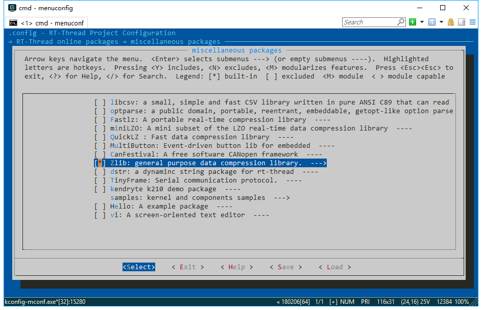

# Zlib 通用压缩库

## 1、介绍

Zlib 是一款免费的、通用的、合法的、不受任何限制的无损数据压缩库。 [zlib](https://github.com/RT-Thread-packages/zlib) 库是RT-thread针对官方 [zlib](https://github.com/madler/zlib) 的 C 库的移植， 更多信息请参阅[http://www.zlib.net/) 。

## 2、获取方式

-  Git方式获取：
  `git clone https://github.com/RT-Thread-packages/zlib.git`

-  env工具辅助下载：
  menuconfig package path：`RT-Thread online package` -> `miscellaneous package` -> `Zlib`

## 3、示例介绍

### 3.1 获取示例



### 3.2 运行示例

该示例为一个简单的文件压缩和解压的例程，需要依赖文件系统，用到的 `zlib_test` 命令有两个 `-c` 和  `-d` 两个参数。使用 `-c` 参数将会压缩一个文件到另一个文件，`-d` 命令解压一个压缩文件到另一个文件。 

使用方式：

压缩命令： `zlib_test -c test test_com`  

```c
msh />zlib_test -c test test_com
msh />ls
Directory /:
test                145          //压缩前文件大小为 145 字节 
test_com            77           //压缩后文件大小为 77 字节
```
解压命令： `zlib_test -d test_com test_decom  `

```c
msh />zlib_test -d test_com test_decom
msh />ls
Directory /:
test                145          
test_com            77          //压缩后文件大小为 77 字节
test_decom          145         //解压后文件大小为 145 字节
```

## 4、常见问题

注意，压缩文件需要大约 290 k 内存，内存较小时可能会出现压缩失败。

解压文件大约需要 18 k 内存占用。

## 5、参考资料

- Zlib 官方网站：https://zlib.net/


